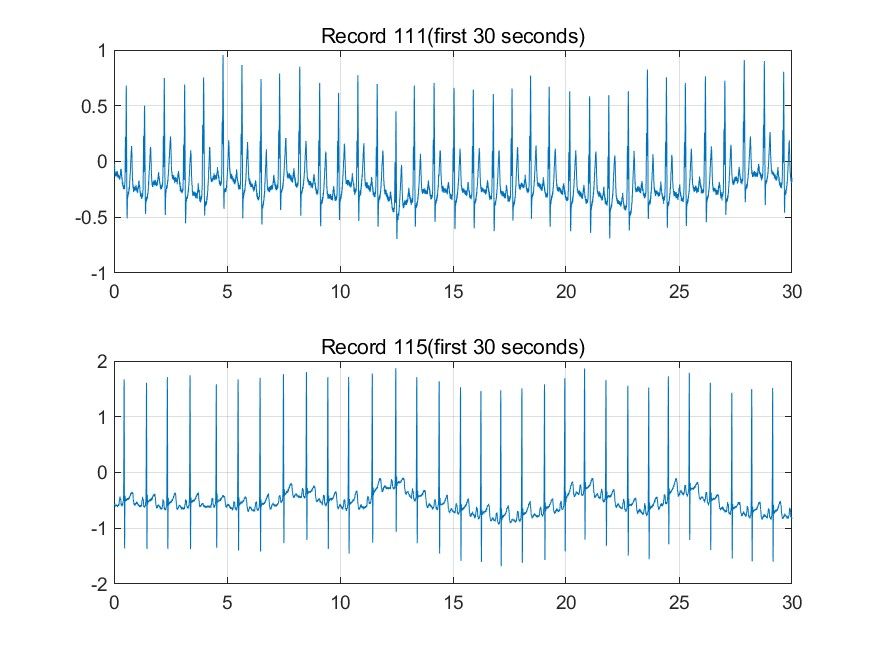

# Matlab: ECG Processing
Common filter and feature extract

Use matlab to build common filters for ecg signal like baseline drift or 60(50) Hz noises:
    
  including:
    
      1.Bandpass filter
      
      2.Wavelet filter
      
      
      

      
Extract certain feature(RR-interval or R peaks)

More Explanation

1. The data is from MIT-BIH Arrhythmia Database, select record 111 and 115 and save it to 111.csv and 115.csv

    Time duration: 60 seconds
    
    Sampling rate: 360 Hz
    
    
2. All code relevant is in main.m, dividing the code by Problem1-6，Problem will be listed in Problem.txt

3. All the result figure is in Fig File from Fig1.jpg ~ Fig6.jpg
 

